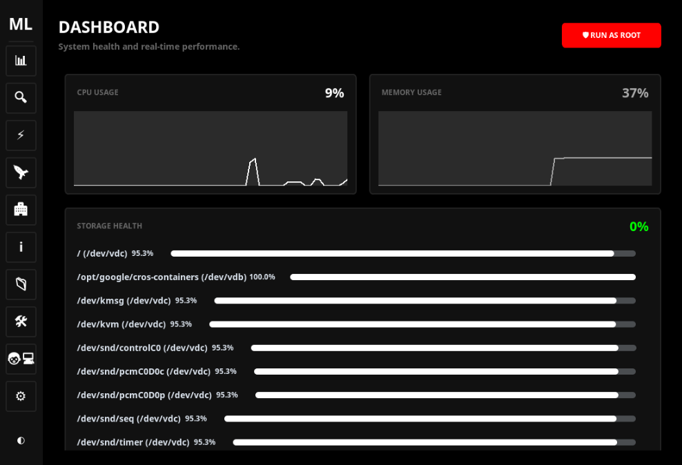

# MLCleaner (MyLightCleaner) v0.3.1.2 STABLE
### The Performance Standard for Low-End Hardware

[](https://mylightcleaner.vercel.app/)
[](https://github.com/kaneki654/MLC)
[](https://www.python.org/)

**MLCleaner** is a professional, **high-performance system cleaner** and **desktop optimizer** designed specifically for **Linux distributions** (Ubuntu, Debian, Fedora, Arch, etc.). Built from the ground up to run flawlessly on legacy processors like the **AMD A4**, it helps you reclaim gigabytes of disk space, monitor system health, and push your hardware to the absolute limit.

<p align="center">
  
</p>

---

## 💻 GUI and CLI Support
MLCleaner now comes in two flavors:
- **Desktop (GUI):** A beautiful, ultra-lightweight interface built with CustomTkinter. Features native Polkit root elevation.
- **Terminal (CLI):** A powerful, high-speed terminal interface built with `rich` for power users and server environments.

👉 **[Explore MLCleaner-CLI Source](./CLI)** | **[Detailed Feature Matrix](./FEATURES.md)** | **[Testing Guide](./TESTING.md)**

---

## 🔍 Implementation Verification
We believe in 100% transparency. Every claimed feature is linked to its source code implementation to ensure the community can validate our work.

- **Cleaning Core:** [engine.py](https://github.com/kaneki654/MLC/blob/main/PyCleaner/cleaners/engine.py)
- **Kernel Tuner:** [system_cleaner.py](https://github.com/kaneki654/MLC/blob/main/PyCleaner/cleaners/system_cleaner.py)
- **Hardware Intel:** [info_view.py](https://github.com/kaneki654/MLC/blob/main/PyCleaner/ui/info_view.py)
- **Zero-Lag UI:** [design_system.py](https://github.com/kaneki654/MLC/blob/main/PyCleaner/ui/design_system.py)

See the full **[Feature Matrix](./FEATURES.md)** for a complete mapping.

---

## 🔥 Why MLCleaner?
If you are looking for a **Stacer alternative** or a more modern **BleachBit alternative**, MLCleaner provides a faster, developer-centric approach to system maintenance with a specific focus on low-end hardware optimization.

- **Legacy Optimized:** Graphs and UI components rewritten to guarantee 60FPS on AMD A4 APUs.
- **Developer First:** Built-in support for cleaning **Docker**, **NPM**, **Go**, **Yarn**, **Python (Pip)**, and **Git** artifacts.
- **Gaming Boost:** One-click kernel optimization to force maximum CPU performance and flush RAM caches.
- **Intelligent:** Real-time **Hardware Dashboards**, **Startup Managers**, and **Security Permission analysis**.

---

## 🚀 Key Features (Updated for v0.3.1.2)

### 🧹 Advanced Junk Removal
*   **Deep App Cleaning:** Native support for 12+ browsers (Brave, Vivaldi, Edge, LibreWolf) and dev tools.
*   **System Maintenance:** Clear **APT cache**, thumbnail databases, journal logs, and `/tmp` directories.
*   **Modern App Support:** Deep clean **Flatpak runtimes**, **Snap packages**, Discord, Slack, Zoom, and Spotify data.

### 🏥 System Health & Security
*   **Integrated Root Elevation:** Native Polkit integration (`pkexec`) to clean restricted logs and system journals safely.
*   **Hardware Intelligence Module:** Deep-level analysis including precise CPU models, physical core mapping, and detailed partition data.
*   **System Optimizer:** Deep RAM flushing, Swap memory defragmentation, and Startup Application Manager.
*   **Security Analyzer:** Scans for unsafe "world-writable" permissions in your Home directory with one-click fixes.

### 🔍 Deep Analysis Tools
*   **Optimized Duplicate Finder:** "Fast Hash" mode (Head/Tail hashing) specifically designed to reduce disk I/O on older drives before full MD5 validation.
*   **Root-Level SCAN:** Global filesystem search for massive files (50MB to 1TB+).
*   **Network Diagnostic:** Integrated global DNS latency ping tool in the Toolbox.
*   **Zero-Space Snapshots:** Hard-link based directory backups with zero byte overhead.

---

## 📥 Installation

### Desktop Version (.deb)
Download the latest **.deb** package for Debian/Ubuntu-based systems directly from our official page:

👉 **[Download MLCleaner v0.3.1.2](https://mylightcleaner.vercel.app/)**

```bash
# To install the downloaded .deb package
sudo dpkg -i MLCleaner_v0.3.1.2_amd64.deb
sudo apt install -f
```

### CLI Version (Fast Installation)
Install directly from the source without cloning:
```bash
pip install git+https://github.com/kaneki654/MLC.git#subdirectory=CLI
```
*Alternatively, if installing from a local clone:*
```bash
cd CLI
pip install .
mlc-cli
```

---

## 📦 Releases

| Version | Type | Release Date | Status |
|---------|------|--------------|--------|
| **v0.3.1.2** | GUI | 2026-03-02 | [Stable] |
| **v0.3.0.1** | CLI | 2026-02-05 | Legacy |
| **v0.3.0** | GUI | 2026-02-05 | Legacy |
| **v0.2.0** | GUI | 2026-02-05 | Legacy |
| **v0.1.0** | GUI | 2026-02-04 | Initial |

---

## 🛠️ Built With
- **Python 3**: Core logic and system integration.
- **CustomTkinter**: Modern, GPU-accelerated UI framework.
- **Psutil**: High-precision hardware and resource monitoring.
- **Polkit/pkexec**: Native Linux privilege escalation.
- **Smartmontools**: Advanced physical drive health diagnostics.

---

## 📜 Version History

### [v0.3.1.2] - 2026-03-02 (CURRENT)
**The Hardware & Performance Update**
- **Legacy Support:** Optimized Graph Engine (removed splines/stippling) for AMD A4 processors.
- **Gaming Boost v2:** Automatic CPU scaling governor ('performance') and kernel RAM cache flushing.
- **Integrated Root:** Native Polkit integration for seamless privileged operations.
- **Hardware Intel:** Comprehensive dashboard showing CPU models, cores, and partitions.
- **Startup Manager:** Control boot sequence and background autostart applications.
- **Network Tool:** Global DNS latency ping diagnostic.

### [v0.3.0.1] - 2026-02-05 (CLI)
- **Terminal Optimization:** Modular architecture for high-speed terminal interaction.

### [v0.3.0] - 2026-02-05 (GUI)
**Optimization Update: Power & Control**
- **System Optimizer:** Real-time RAM/Swap flushing and Kernel PageCache purging.
- **Global SCAN:** Expanded "Large Files" to root-level global search.
- **Native Trash:** Added "Move to Trash" support and DOD-standard Shredding.

### [v0.2.0] - 2026-02-05
**Security Update: Health & Monitoring**
- **SMART Monitor:** Physical drive longevity tracking.
- **Permission Analyzer:** Harden world-writable files in Home directory.

---
---

**Keywords:** Linux Cleaner, System Optimizer, CLI System Tools, Ubuntu Optimizer, Python Desktop App, Terminal Junk Remover, BleachBit Alternative, Stacer Alternative, Docker Prune GUI, Flatpak Cleanup, Linux Security Tool, AMD A4 Optimizer, Low End PC Cleaner.

<p align="center">
  Developed By <strong>G0Ju.VBS</strong>
</p>
